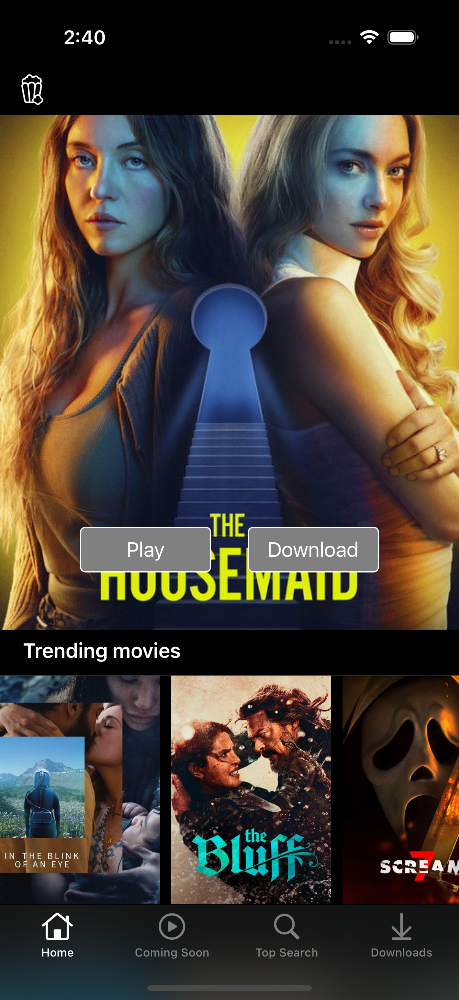
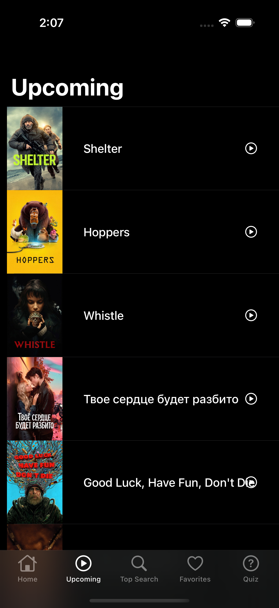
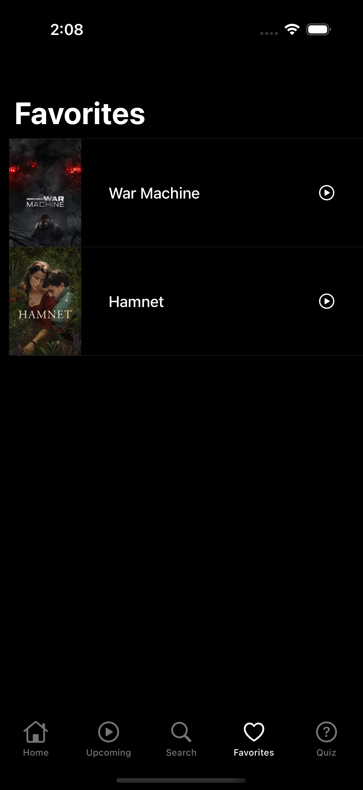
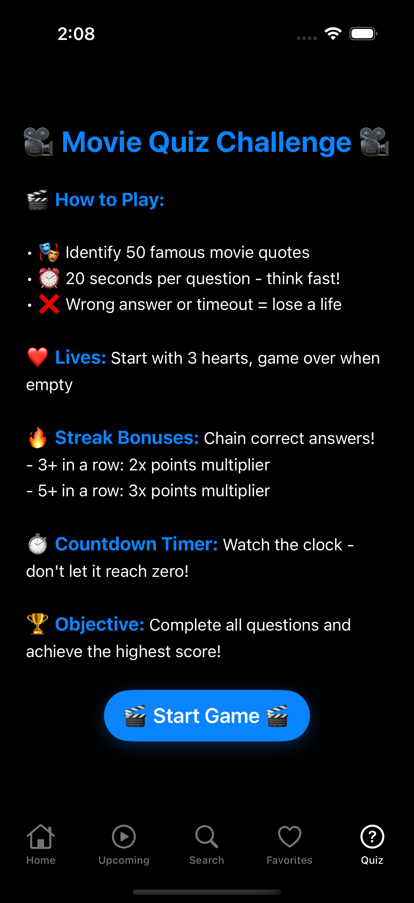
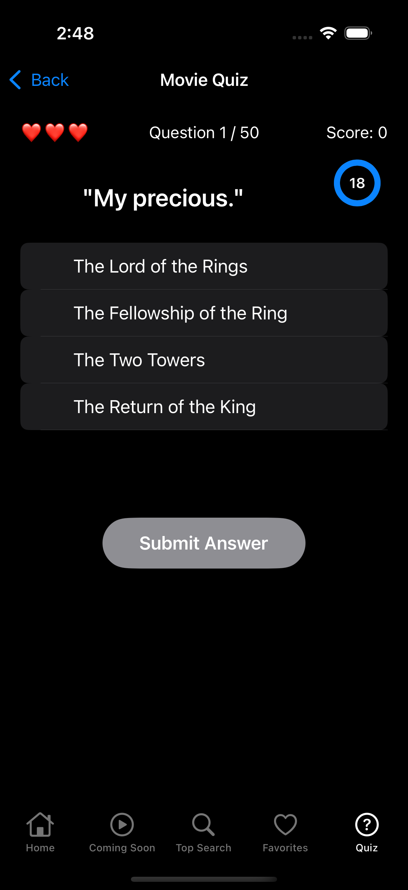
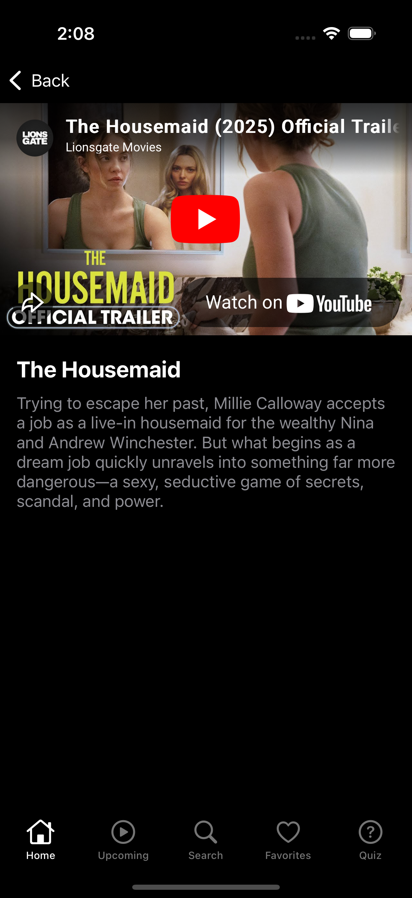

# Movie-Trailers

**Movie-Trailers** is a native **iOS demo application built with Swift and UIKit** that recreates a Netflix-style browsing experience.  
The app consumes data from **The Movie Database (TMDB)** and plays trailer previews using **YouTube**, focusing on clean UI composition, scalable architecture, and real-world iOS development patterns.

This project demonstrates API integration, asynchronous image loading, Core Data persistence, and complex collection-based layouts commonly used in production-grade media apps.

---

## 📱 App Overview

Movie-Trailers allows users to explore movies and TV shows across multiple categories such as trending, popular, upcoming, and top-rated titles.  
Users can search for content, preview trailers directly inside the app, and save titles locally for later viewing.

---

## ✨ Key Features

- 🎬 **Content Browsing**  
  Browse categorized lists including:
  - Trending Movies  
  - Trending TV Shows  
  - Popular Titles  
  - Upcoming Releases  
  - Top-Rated Content  

- 🔍 **Search Functionality**  
  Search for movies using TMDB’s search endpoint with real-time results.

- ▶️ **Trailer Preview**  
  Watch trailers embedded using `YouTubeiOSPlayerHelper` within a dedicated preview screen.

- 💾 **Local Persistence**  
  Save and manage downloaded titles locally using **Core Data**.

- 🖼️ **Efficient Image Loading**  
  Asynchronous poster image loading and caching powered by **SDWebImage**.

---

## Screenshots

<table align="center">
  <tr>
    <td align="center">
       
      <b>Main Screen</b>
    </td>
    <td align="center">
       
      <b>Main Screen</b>
    </td>
  </tr>
  <tr>
    <td align="center">
       
      <b>Search Screen</b>
    </td>
    <td align="center">
       
      <b>Upcoming Screen</b>
    </td>
  </tr>
  <tr>
    <td align="center">
       
      <b>Download Option</b>
    </td>
    <td align="center">
       
      <b>Download screen</b>
    </td>
  </tr>
   <tr>
    <td align="center">
       
      <b>Watch Trailer</b>
    </td>
  </tr>
</table>

## 🏗️ Architecture & Design

- UIKit-based, programmatic UI
- Clear separation of concerns across networking, persistence, and UI layers
- Table-of-collections layout pattern (Netflix-style home feed)
- Centralized API handling via `APICaller`
- Reusable and modular UI components

---

## 🛠️ Tech Stack

- **Language:** Swift  
- **UI Framework:** UIKit  
- **Networking:** URLSession  
- **Persistence:** Core Data  
- **Third-Party Libraries:**  
  - `SDWebImage` – image loading & caching  
  - `YouTubeiOSPlayerHelper` – trailer playback  

---

🔍 How It Works (High Level)

- The home screen loads categorized content using TMDB endpoints via APICaller.
- Each category is displayed as a horizontally scrolling UICollectionView embedded in a UITableViewCell.
- Selecting a title triggers a YouTube search (title name + “trailer”) and opens a preview screen with an embedded player.
- Downloaded titles are persisted locally using Core Data through DataPersistenceManager.
